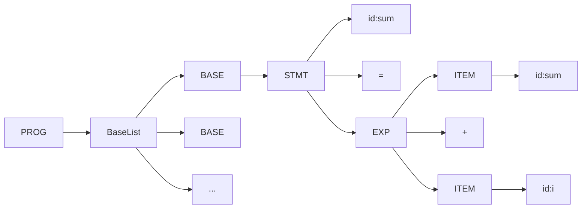
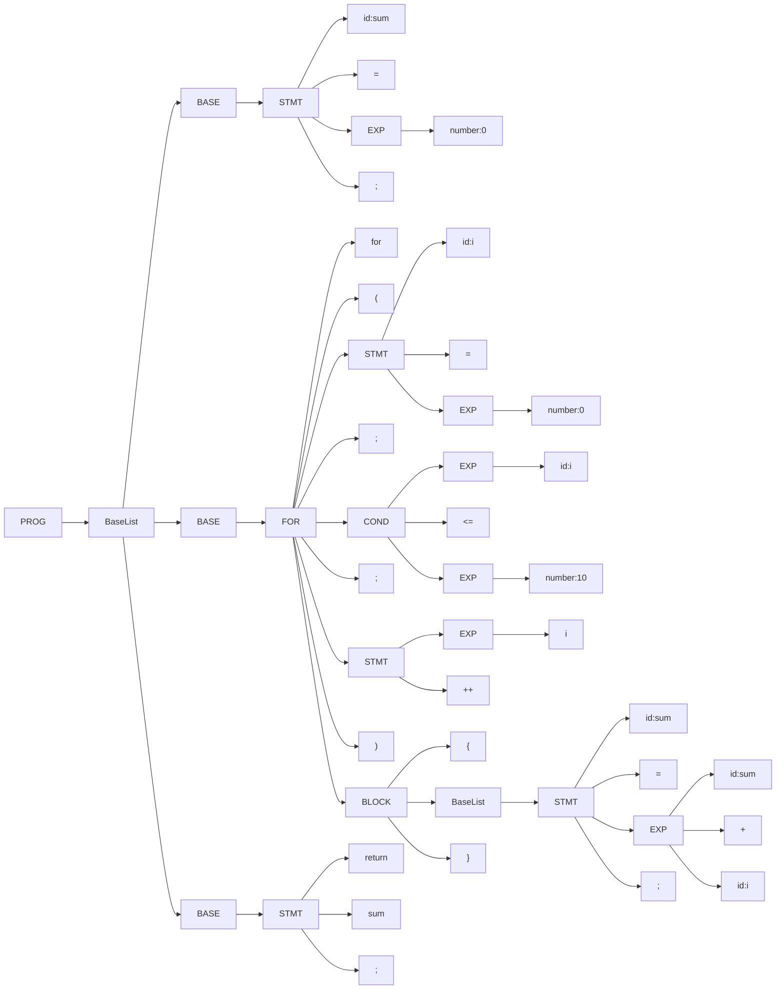

# Overview

This program is a simple compiler for C language(a simple languge C0). The main target is to display how a system program works. It was developed by C language and consists of:
- [Compiler](#compiler)
- [Assember](#assembler)
- [Virtual Machine](#virtual-machine)

The C0 program will be compiled to assembly file. The assembly file will be converted to object file by the assembler. Virtual machine will execute the object file and display the result. An [Example](#an-example-of-complete-progress) of the whole progress from compoiling C0 program to execution is dispalyed in this article.

The C-like simple language C0 supports,
- Assignment
- Integer arithmetic operation
- For loop

This program also contains following labraries of data structure used by the compiler and their operations,
- Array
- Tree
- HashTable

# Compiler

The main function of Compiler is to compile the C0 program, and export an assembly code file. The compiler consists of:
- [Scanner](#scanner)
- [Parser](#parser)
- [Generator](#generator)

Text of C0 language is divided into tokens by Scanner. Parser will generate a syntax tree from an Array of tokens. Syntax tree will be translated to P-code then to assembly code by Generator.

## Scanner

Scanner imported a C0 program file and returned an Array of tokens. The progress is shown as below,
1. Construct an Array to store tokens of C0 file.
2. Construct a Scanner to read the text of C0 file.
3. Scanner scanned C0 file according to the types of token and push to the Array.
4. Deconstruct the scanner
5. Return the Array of tokens

Types of token is shown as following table,

| Type     | Description                |
|:-------- |:-------------------------- |
| String   | string                     |
| Number   | number                     |
| ID       | id = [A-Za-z][0-9_A-Za-z]* |
| KEYWORDS | if, for, while, return     |
| OP1      | ++, -\-                    |
| OP2      | +, -, \*, \/               |
| COND_OP  | ==, !=, >=, <=, >, <       |
| ITEM     | id, number, string         |
| OP       | +, -, \*, \/, <, =, >, !   |
| OTHERS   | {}, (), ...                |

- \* repeats more than 0 times

### Example

A C0 code ```sum = sum + i``` could be divided as following table,
| Token | sum |  =  | sum |  +  |  i  |
|:-----:|:---:|:---:|:---:|:---:|:---:|
| Type  | id  |  =  | id  |  +  | id  |


## Parser

The Parser created a syntax tree from Array of tokens. We use EBNF to desribe Syntax rule of C0 language as following table,

|     | Syntax Rule |                                                    |
| --- |:----------- |:-------------------------------------------------- |
| 1   | PROG        | BaseList                                           |
| 2   | BaseList    | (BASE)\*                                           |
| 3   | BASE        | FOR \| STMT ';'                                    |
| 4   | FOR         | 'for''('STMT';' COND';' STMT')' BLOCK              |
| 5   | STMT        | 'return 'id \| id'='EXP \| id('++' \| '--')        |
| 6   | BLOCK       | '{'BaseList'}'                                     |
| 7   | EXP         | ITEM([\+\-\*\/]ITEM)?                              |
| 8   | COND        | EXP('==' \| '!=' \| '<=' \| '>=' \| '<' \| '>')EXP |
| 9   | ITEM        | id \| number                                       |
| 10  | id          | [A-Za-z_][A-Za-z0-9_]*                             |
| 11  | number      | [0-9]+                                             |

- \* repeats more than 0 time
- \+ repeats more than 1 time
- \? appears 0 or 1 time

According syntax rule, we could create a syntax tree of ```sum = sum + i``` as below,



## Generator

Generator converted syntax tree to P-code, then to assembly code. syntax tree will be traversed by recursion, and translate each node to P-code. Below is an example to show format of P-code,

| C0 code        | Label | Operator | Parameter 1 | Parameter 2 | Parameter 3 |
|:-------------- |:----- | -------- | ----------- | ----------- |:----------- |
| ```sum = 0;``` |       | =        | sum         | 0           |             |
| ```i++;```     |       | +        | i           | 1           | i           |
|                | FOR0: |          |             |             |             |

All variables in use will be put in Symbol Table, which is a Hash Table storing name of each variable.

Length of an instruciton of assembly code is 32 bits. Instructions are sorted into 3 formats, **Arithmatic type**, **Load and Store type**, and **Jump type**. The formats are,

| Type | Format (bit)                                                                        |
| ---- |:----------------------------------------------------------------------------------- |
| A    | ```OP (31-24)``` ```Ra (23-20)``` ```Rb (19-16)``` ```Rc (15-12)``` ```Cx (12-0)``` |
| L    | ```OP (31-24)``` ```Ra (23-20)``` ```Rb (19-16)``` ```Cx (15-0)```                  |
| J    | ```OP (31-24)``` ```Ra (23-20)``` ```Cx (19-0)```                                   |

An Op Table is required to record all instructions, their syntax and operation code. Now, Generator could translate each line of P-code to a series of assembly code according to the Op Table. In addition, all variables used should be tranlated to assembly code. Following is a simple example,

| C0 code          | P-Code               | Assembly Code                                   |
| :--------------- | :------------------- | :---------------------------------------------- |
| ```res = 10```   | ```=    10    res``` | ```LDI    R1    10```<br/>```ST    R1    res``` |
| ```return res``` | ```RET    res```     | ```LD    R1    sum```<br/>```RET```             |

# Assembler

Here is an example of an assembly code translated to object code,
| Address | Assembly Code | Object Code |
| ------- | ------------- | ----------- |
| 0000    | LD R1 B       | 001F000C    |
| 0004    | ST R1 A       | 011F0004    |
| 0008    | RET           | 2C000000    |
| 000C    | A: RESW 1     | 00000000    |
| 0010    | B: WORD 29    | 0000001D    |

There are two stages to translate an assembly code to an object code. In first stage,

1. determine size of memory of each instruction
2. calculate address of each line

In second stage,

3. convert instruction to object code
4. convert parameters, Ra, Rb, Rc, Cx to object code
5. convert data to binary
6. generate object code to object file

# Virtual Machine

The Virtual Machine in this program is to simulate a CPU(CPU0) to execute the object code we generated. The operations are,
1. arithmetic operations
2. logical operations
3. bit operations

CPU0 has 15 accessible regisiters, R1 - R15, and a read-only register R0. Value of R0 is always 0. R12 - R15 are special-purpose registers hold some elements of program state,
- R12: Status Word, SW
- R13: Stack Pointer, SP
- R14: Link Register, LR
- R15: Program Counter, PC

## Status Sword

The Status Word is a register to store CPU status,

| Status Word | N   | Z   | C   | V   | Reserved | I   | T   | Reserved | Mode |
| ----------- | --- | --- | --- | --- | -------- | --- | --- |:-------- | ---- |
| Bits        | 31  | 30  | 29  | 28  | 27-8     | 7   | 6   | 5-1      | 0    |

- N: Negative
- Z: Zero
- C: Carry
- V: Overflow
- I: Interupt
- T: Trap

N, Z flags are used for logical operation, comparison. ```CMP Ra Rb``` will conduct a substraction ```Ra - Rb```, and the results correspond to following comditions,
1. Ra > Rb --> N = 0, Z = 0
2. Ra < Rb --> N = 1, Z = 0
3. Ra = Rb --> N = 0, Z = 1

I, T are used for system interupt.
- I = 0, disable all interuption
- T = 0, disable software interuption, but hardware interuption is enable.

Mode is used to control system mode.
- M = 0, User Mode
- M = 1, Monitor Mode

## Program Counter

The program Counter is a register used to indicate the address of the instruciton in a program. Below is the instruction cycle of each stage,
### Fetch Stage
1. The address of next instruction stored in PC is stored into instruction register(IR).
2. The PC points to next instruction
### Decode Stage
3. The encoded instruction stored in IR is decoded to machine code.
### Exacute
4. The control unit of CPU passes decoded information to ALU for mathematical or logical operations, and writes the results back to register.

# An Example of Complete Progress

Here is a simple C language program, and the complete progress from compiling, assembling to executing will be display below.

```c 
sum = 0;
for(i = 0; i <= 10; i++){
    sum = sum + i;
}
return sum;
```

## Compiler

Compiler read the C file, and assign the text to a string type variable. Then call Scanner to divide text to an Array of tokens.

### Scaner

Text of C file are scanned to tokens and push to an array.
```
token = sum
token = =
token = 0
token = ;
token = for
token = (
token = i
token = =
token = 0
token = ;
token = i
token = <=
token = 10
token = ;
token = i
token = ++
token = )
token = {
token = sum
token = =
token = sum
token = +
token = i
token = ;
token = }
token = return
token = sum
token = ;
```

### Parser

Parser generate a syntax tree.



### Generator

Generator translate the syntax tree to P-code then to assembly code.

#### P-code
```
         =    0         sum 
         =    0         i   
FOR0:                       
         CMP  i    10       
         J    >         _FOR0
         +    sum  i    T0  
         =    T0        sum 
         +    i    1    i   
         J              FOR0
_FOR0:                      
         RET            sum 
```

#### Assembly Code
```
         LDI  R1   0        
         ST   R1   sum      
         LDI  R1   0        
         ST   R1   i        
FOR0:                       
         LD   R1   i        
         LDI  R2   10       
         CMP  R1   R2       
         JGT  _FOR0          
         LD   R1   sum      
         LD   R2   i        
         ADD  R3   R1   R2  
         ST   R3   T0       
         LD   R1   T0       
         ST   R1   sum      
         LD   R1   i        
         LDI  R2   1        
         ADD  R3   R1   R2  
         ST   R3   i        
         JMP  FOR0          
_FOR0:                      
         LD   R1   sum      
         RET                
sum:     RESW 1             
i:       RESW 1             
T0:      RESW 1  
```

## Assembler

Assembler translate assembly file to object file in 2 stage.
### Stage 1: determine size of each instruction
```
0000          LDI  R1   0         L  8 (NULL)
0004          ST   R1   SUM       L  1 (NULL)
0008          LDI  R1   0         L  8 (NULL)
000C          ST   R1   I         L  1 (NULL)
0010 FOR0:                          FF (NULL)
0010          LD   R1   I         L  0 (NULL)
0014          LDI  R2   10        L  8 (NULL)
0018          CMP  R1   R2        A 10 (NULL)
001C          JGT  _FOR0          J 23 (NULL)
0020          LD   R1   SUM       L  0 (NULL)
0024          LD   R2   I         L  0 (NULL)
0028          ADD  R3   R1   R2   A 13 (NULL)
002C          ST   R3   T0        L  1 (NULL)
0030          LD   R1   T0        L  0 (NULL)
0034          ST   R1   SUM       L  1 (NULL)
0038          LD   R1   I         L  0 (NULL)
003C          LDI  R2   1         L  8 (NULL)
0040          ADD  R3   R1   R2   A 13 (NULL)
0044          ST   R3   I         L  1 (NULL)
0048          JMP  FOR0           J 26 (NULL)
004C _FOR0:                         FF (NULL)
004C          LD   R1   SUM       L  0 (NULL)
0050          RET                 J 2C (NULL)
0054 SUM:     RESW 1              D F0 (NULL)
0058 I:       RESW 1              D F0 (NULL)
005C T0:      RESW 1              D F0 (NULL)
```
#### Symbol Table
```
005C T0:      RESW 1              D F0 (NULL)
0010 FOR0:                          FF (NULL)
0054 SUM:     RESW 1              D F0 (NULL)
0058 I:       RESW 1              D F0 (NULL)
004C _FOR0:                         FF (NULL)
```

### Stage 2: convert to object code
```
0000          LDI  R1   0         L  8 08100000
0004          ST   R1   SUM       L  1 011F004C
0008          LDI  R1   0         L  8 08100000
000C          ST   R1   I         L  1 011F0048
0010 FOR0:                          FF 
0010          LD   R1   I         L  0 001F0044
0014          LDI  R2   10        L  8 0820000A
0018          CMP  R1   R2        A 10 10120000
001C          JGT  _FOR0          J 23 2300002C
0020          LD   R1   SUM       L  0 001F0030
0024          LD   R2   I         L  0 002F0030
0028          ADD  R3   R1   R2   A 13 13312000
002C          ST   R3   T0        L  1 013F002C
0030          LD   R1   T0        L  0 001F0028
0034          ST   R1   SUM       L  1 011F001C
0038          LD   R1   I         L  0 001F001C
003C          LDI  R2   1         L  8 08200001
0040          ADD  R3   R1   R2   A 13 13312000
0044          ST   R3   I         L  1 013F0010
0048          JMP  FOR0           J 26 26FFFFC4
004C _FOR0:                         FF 
004C          LD   R1   SUM       L  0 001F0004
0050          RET                 J 2C 2C000000
0054 SUM:     RESW 1              D F0 00000000
0058 I:       RESW 1              D F0 00000000
005C T0:      RESW 1              D F0 00000000
```

#### Export Object File

08100000011F004C08100000011F0048001F00440820000A101200002300002C001F0030002F003013312000013F002C001F0028011F001C001F001C0820000113312000013F001026FFFFC4001F00042C000000000000000000000000000000


## Virtual Machine

Operation of each instruction of the virtual machine is too long to display here.
However, the register dump of the simulated CPU is shown as below. The program returned the sum of integer from 1 to 10, so the register R1 load the value of "sum" (```R[01]=0x00000037=55```).

```
IR =0x2c000000=738197504
R[00]=0x00000000=0
R[01]=0x00000037=55
R[02]=0x0000000a=10
R[03]=0x0000000b=11
R[04]=0x00000000=0
R[05]=0x00000000=0
R[06]=0x00000000=0
R[07]=0x00000000=0
R[08]=0x00000000=0
R[09]=0x00000000=0
R[10]=0x00000000=0
R[11]=0x00000000=0
R[12]=0x00000000=0
R[13]=0x00000000=0
R[14]=0xffffffff=-1
R[15]=0x00000054=84
```

# Reference

陳鍾誠, 系統程式, http://sp1.wikidot.com/
